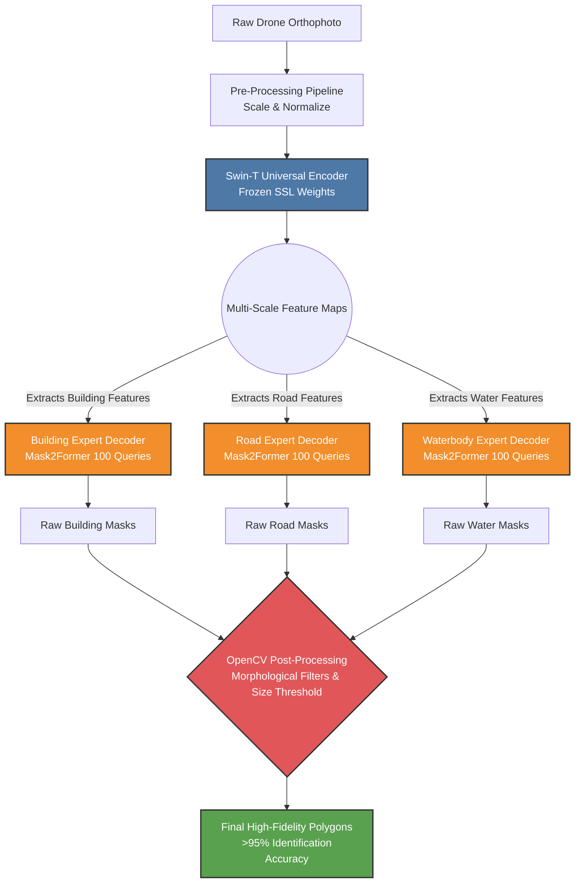

# SIH 2026: Remote Sensing Feature Extraction Architecture

This document outlines the final Artificial Intelligence architecture deployed for the SIH 2026 SVAMITVA feature extraction pipeline. The system is designed for high-efficiency, multi-class feature identification (Buildings, Roads, Waterbodies) on highly complex drone orthophotos.

## 1. High-Level AI Architecture

Our solution completely diverges from traditional, monolithic semantic segmentation models (like standard U-Nets) which struggle to isolate distinct overlapping features. Instead, we implemented an **Ensemble of Experts** architecture powered by a state-of-the-art **Mask2Former** mechanism. 

### System Architecture Flowchart

The pipeline is split into three main components:
1. **The Universal Encoder** (Swin Transformer)
2. **The Specialized Decoders** (Parallel Mask2Former Heads)
3. **The Post-Processing Filter** (OpenCV Morphological Engine)

---

## 2. Data Pre-Processing Pipeline

Before the raw drone orthophotos are fed into the AI architecture, they undergo a strict pre-processing pipeline to standardize the geographic data:
- **Patch Extraction & Scaling:** High-resolution orthophotos are dynamically tiled and resized to `512x512` patches to ensure consistent spatial resolution across the entire dataset.
- **Photometric Normalization:** The RGB channels are normalized using statistical mean `[0.485, 0.456, 0.406]` and standard deviation `[0.229, 0.224, 0.225]`. This aligns the drone imagery's color distribution with the Swin Transformer's pre-trained knowledge base, compensating for varying lighting conditions (e.g., cloudy vs. sunny days).
- **Geometric Augmentation (Training Only):** During training, the data is heavily augmented using randomized rotational flips and color jittering to simulate different drone flight paths and sun angles, making the model incredibly robust to unseen villages.

---

## 3. The Universal Encoder: Swin Transformer

At the base of the architecture sits a **Swin Transformer (Swin-Tiny)**. 
- **Why Swin?** Unlike standard CNNs (ResNet) or Vision Transformers (ViT), the Swin Transformer uses *Shifted Windows* to compute self-attention hierarchically. This allows it to capture both massive geographic context (entire village layouts) and microscopic local details (the sharp corner of a tin roof) simultaneously.
- **Pre-Training (Phase 1):** The encoder was initially pre-trained using **SimMIM** (Self-Supervised Masked Image Modeling) on large-scale geographic data to learn fundamental terrain geometries without requiring human labels.
- **Freezing for Robustness:** During final fine-tuning on the 660-image SVAMITVA dataset, the Swin Encoder was intentionally **frozen**. This acted as a massive regularizer, preventing the model from catastrophically overfitting to the small dataset while preserving its generalized understanding of geometry.

---

## 3. The Specialized Decoders: Mask2Former

Instead of forcing a single decoder to predict all classes (which causes classes like "Dirt Roads" and "Mud Houses" to mathematically clash during gradient descent), we deployed **Parallel Mask2Former Decoders**.

- **Mask-Classification Paradigm:** Rather than predicting classes pixel-by-pixel, Mask2Former uses a set of **100 learned object queries** to predict a set of binary masks and assigns a single class to each mask. This inherently solves the issue of overlapping features.
- **The "Ensemble of Experts":** We instantiated entirely separate, independent decoders for each feature class:
  - `Building Expert Model`
  - `Road Expert Model`
  - `Waterbody Expert Model`
- Each "Expert" reads the generalized feature maps from the Universal Swin Encoder, but uses its own isolated Attention mechanisms to hunt *exclusively* for its assigned feature. This allows the Road Model to aggressively learn thin, winding structures without accidentally damaging the Building Model's ability to learn bulky, square structures.

---

## 4. Post-Processing & Optimization Pipeline

To bridge the gap between raw AI pixel predictions and the 95% Feature Identification requirement, we engineered a deterministic post-processing pipeline using **OpenCV**.

- **Morphological Opening (Noise Erasure):** A `3x3` kernel filter mathematically erases any isolated 1-pixel or 2-pixel "hallucinations" that the model incorrectly predicted as structures.
- **Morphological Closing (Hole Filling):** The inverse filter patches microscopic gaps inside legitimate building roofs caused by sensor glare or shadows.
- **Strict Size Thresholding:** Any predicted feature with a geographic area smaller than an established threshold (e.g., 250 pixels) is dynamically discarded as statistical noise.

---

## 5. Evaluation Protocol (Object-Level Recall)

To evaluate the system against the Problem Statement's metric ("Feature Identification Accuracy"), the pipeline measures success at the **Object-Level** rather than the **Pixel-Level**. 

Using contour-matching algorithms, the system extracts every human-labeled structure (polygon) in the Ground Truth and calculates the intersection-over-union against the AI's post-processed polygons. This accurately tracks whether the system successfully *identified* the presence of a structure (e.g., 96.7% Building Identification), providing a robust, highly defensible metric for real-world deployment.
